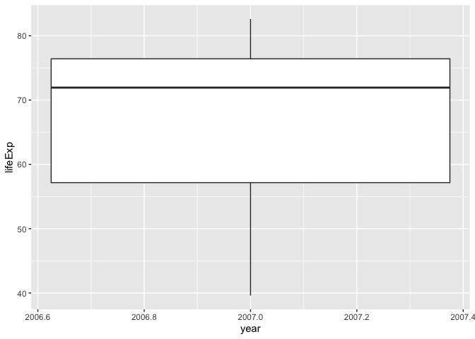

## Instructions
Answer the following questions and complete the exercises in RMarkdown. Please embed all of your code and push your final work to your repository. Your final lab report should be organized, clean, and run free from errors. Remember, you must remove the `#` for any included code chunks to run.  

## Libraries

```r
library(tidyverse)
```

## Resources
The idea for this assignment came from [Rebecca Barter's](http://www.rebeccabarter.com/blog/2017-11-17-ggplot2_tutorial/) ggplot tutorial so if you get stuck this is a good place to have a look.  

## Gapminder
For this assignment, we are going to use the dataset [gapminder](https://cran.r-project.org/web/packages/gapminder/index.html). Gapminder includes information about economics, population, and life expectancy from countries all over the world. You will need to install it before use. This is the same data that we used for the practice midterm. You may want to load that assignment for reference.  

```r
library("gapminder")
```

## Questions
The questions below are open-ended and have many possible solutions. Your approach should, where appropriate, include numerical summaries and visuals. Be creative; assume you are building an analysis that you would ultimately present to an audience of stakeholders. Feel free to try out different `geoms` if they more clearly present your results.  

**1. Use the function(s) of your choice to get an idea of the overall structure of the data frame, including its dimensions, column names, variable classes, etc. As part of this, determine how NAs are treated in the data.**  


```r
str(gapminder)
```

```
## Classes 'tbl_df', 'tbl' and 'data.frame':	1704 obs. of  6 variables:
##  $ country  : Factor w/ 142 levels "Afghanistan",..: 1 1 1 1 1 1 1 1 1 1 ...
##  $ continent: Factor w/ 5 levels "Africa","Americas",..: 3 3 3 3 3 3 3 3 3 3 ...
##  $ year     : int  1952 1957 1962 1967 1972 1977 1982 1987 1992 1997 ...
##  $ lifeExp  : num  28.8 30.3 32 34 36.1 ...
##  $ pop      : int  8425333 9240934 10267083 11537966 13079460 14880372 12881816 13867957 16317921 22227415 ...
##  $ gdpPercap: num  779 821 853 836 740 ...
```

```r
summary(gapminder)
```

```
##         country        continent        year         lifeExp     
##  Afghanistan:  12   Africa  :624   Min.   :1952   Min.   :23.60  
##  Albania    :  12   Americas:300   1st Qu.:1966   1st Qu.:48.20  
##  Algeria    :  12   Asia    :396   Median :1980   Median :60.71  
##  Angola     :  12   Europe  :360   Mean   :1980   Mean   :59.47  
##  Argentina  :  12   Oceania : 24   3rd Qu.:1993   3rd Qu.:70.85  
##  Australia  :  12                  Max.   :2007   Max.   :82.60  
##  (Other)    :1632                                                
##       pop              gdpPercap       
##  Min.   :6.001e+04   Min.   :   241.2  
##  1st Qu.:2.794e+06   1st Qu.:  1202.1  
##  Median :7.024e+06   Median :  3531.8  
##  Mean   :2.960e+07   Mean   :  7215.3  
##  3rd Qu.:1.959e+07   3rd Qu.:  9325.5  
##  Max.   :1.319e+09   Max.   :113523.1  
## 
```

**2. Among the interesting variables in gapminder is life expectancy. How has global life expectancy changed between 1952 and 2007?**

```r
gapminder %>%
  select(lifeExp, year) %>%
  filter(year == 1952) %>%
  summarise(life_exp_1952 = mean(lifeExp))
```

```
## # A tibble: 1 x 1
##   life_exp_1952
##           <dbl>
## 1          49.1
```

```r
gapminder %>%
  select(lifeExp, year) %>%
  filter(year == 2007) %>%
  summarise(life_exp_2007 = mean(lifeExp))
```

```
## # A tibble: 1 x 1
##   life_exp_2007
##           <dbl>
## 1          67.0
```


**3. How do the distributions of life expectancy compare for the years 1952 and 2007? _Challenge: Can you put both distributions on a single plot?_**

```r
gapminder %>%
  select(year, lifeExp) %>%
  filter(year == 2007) %>%
  ggplot(aes(x = year, y = lifeExp)) +
  geom_boxplot()
```

<!-- -->

```r
gapminder %>%
  select(year, lifeExp) %>%
  filter(year == 1952) %>%
  ggplot(aes(x = year, y = lifeExp)) +
  geom_boxplot()
```

<!-- -->


**4. Your answer above doesn't tell the whole story since life expectancy varies by region. Make a summary that shows the min, mean, and max life expectancy by continent for all years represented in the data.**


```r
gapminder %>%
  select(lifeExp, year, continent) %>%
  filter(year >= 1952) %>%
  pivot_wider(
    names_from = continent,
    values_from = lifeExp,
    values_fn = list(lifeExp = mean)) %>%
  summary()
```

```
##       year           Asia           Europe          Africa         Americas    
##  Min.   :1952   Min.   :46.31   Min.   :64.41   Min.   :39.14   Min.   :53.28  
##  1st Qu.:1966   1st Qu.:53.89   1st Qu.:69.44   1st Qu.:44.83   1st Qu.:59.91  
##  Median :1980   Median :61.11   Median :72.37   Median :50.59   Median :65.31  
##  Mean   :1980   Mean   :60.06   Mean   :71.90   Mean   :48.87   Mean   :64.66  
##  3rd Qu.:1993   3rd Qu.:66.91   3rd Qu.:74.71   3rd Qu.:53.41   3rd Qu.:69.96  
##  Max.   :2007   Max.   :70.73   Max.   :77.65   Max.   :54.81   Max.   :73.61  
##     Oceania     
##  Min.   :69.25  
##  1st Qu.:71.25  
##  Median :73.57  
##  Mean   :74.33  
##  3rd Qu.:77.26  
##  Max.   :80.72
```

**5. How has life expectancy changed between 1952-2007 for each continent? Try using `geom_line()` for this, including all continents on the same  plot.**

```r
gapminder %>%
  select(lifeExp, year, continent) %>%
  filter(year %in% c(1952, 2007)) %>%
   pivot_wider(
    names_from = continent,
    values_from = lifeExp,
    values_fn = list(lifeExp = mean)) %>%
  pivot_longer(Asia:Oceania,
               names_to = "continent",
               values_to = "lifeexp") %>%
  ggplot(aes(x = year, y = lifeexp, group = continent, color = continent)) +
  geom_line()
```

<!-- -->


**6. We are interested in the relationship between per capita GDP and life expectancy; i.e. does having more money help you live longer?**

```r
gapminder %>%
  select(gdpPercap, lifeExp) %>%
  arrange(desc(gdpPercap)) %>%
  ggplot(aes(x = lifeExp, y = gdpPercap)) +
  geom_jitter()
```

<!-- -->


**7. There is extreme disparity in per capita GDP. Rescale the x axis to make this easier to interpret. How would you characterize the relationship?**

```r
gapminder %>%
  mutate(log_gdp = log10(gdpPercap)) %>%
  select(log_gdp, lifeExp) %>%
  arrange(desc(log_gdp)) %>%
  ggplot(aes(x = log_gdp, y = lifeExp)) +
  geom_point()
```

<!-- -->


**8. Which countries have had the largest population growth since 1952?**

```r
gap_growth <- gapminder %>%
  select(year, country, pop) %>%
  filter(year == c(1952, 2007)) %>%
  pivot_wider(
    names_from = year,
    values_from = pop) %>%
  mutate(diff_pop = `2007` - `1952`,
         diff_year = 2007 - 1952,
         growth = diff_pop / diff_year) %>%
  arrange(desc(growth))
gap_growth
```

```
## # A tibble: 142 x 6
##    country          `1952`     `2007`  diff_pop diff_year    growth
##    <fct>             <int>      <int>     <int>     <dbl>     <dbl>
##  1 China         556263527 1318683096 762419569        55 13862174.
##  2 India         372000000 1110396331 738396331        55 13425388.
##  3 United States 157553000  301139947 143586947        55  2610672.
##  4 Indonesia      82052000  223547000 141495000        55  2572636.
##  5 Brazil         56602560  190010647 133408087        55  2425602.
##  6 Pakistan       41346560  169270617 127924057        55  2325892.
##  7 Bangladesh     46886859  150448339 103561480        55  1882936 
##  8 Nigeria        33119096  135031164 101912068        55  1852947.
##  9 Mexico         30144317  108700891  78556574        55  1428301.
## 10 Philippines    22438691   91077287  68638596        55  1247974.
## # … with 132 more rows
```


**9. Use your results from the question above to plot population growth for the top five countries since 1952.**

```r
gap_growth %>%
  select(country, growth) %>%
  top_n(5) %>%
  ggplot(aes(x = country, y = growth, fill = country))+
  geom_bar(stat = "identity")
```

```
## Selecting by growth
```

<!-- -->


**10. How does per capita GDP growth compare between these same five countries?**

```r
gapminder %>%
  select(country, year, gdpPercap) %>%
  filter(country == c("Brazil", "China", "India", "Indonesia", "United States")) %>%
  mutate(log_gdpPercap = log10(gdpPercap)) %>%
  ggplot(aes(x = year, y = log_gdpPercap, fill = country, color = country))+
  geom_line()
```

```
## Warning in `==.default`(country, c("Brazil", "China", "India", "Indonesia", :
## longer object length is not a multiple of shorter object length
```

```
## Warning in is.na(e1) | is.na(e2): longer object length is not a multiple of
## shorter object length
```

<!-- -->


## Push your final code to GitHub!
Please be sure that you check the `keep md` file in the knit preferences. 
