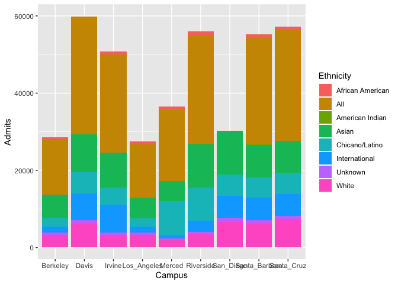
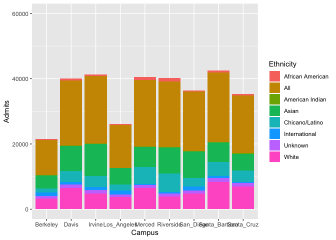
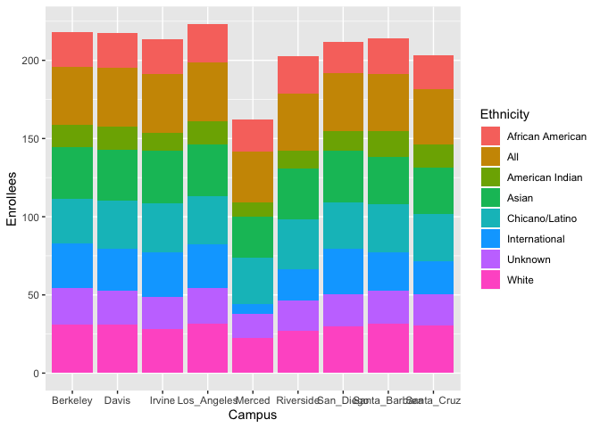

## Instructions
Answer the following questions and complete the exercises in RMarkdown. Please embed all of your code and push your final work to your repository. Your final lab report should be organized, clean, and run free from errors. Remember, you must remove the `#` for any included code chunks to run.  

## Libraries

```r
library(tidyverse)
library(shiny)
library(shinydashboard)
```

## Data
The data for this assignment come from the [University of California Information Center](https://www.universityofcalifornia.edu/infocenter). Admissions data were collected for the years 2010-2019 for each UC campus. Admissions are broken down into three categories: applications, admits, and enrollees. The number of individuals in each category are presented by demographic.  

```r
UC_admit <- readr::read_csv("data/UC_admit.csv")
```

```
## Parsed with column specification:
## cols(
##   Campus = col_character(),
##   Academic_Yr = col_double(),
##   Category = col_character(),
##   Ethnicity = col_character(),
##   `Perc FR` = col_character(),
##   FilteredCountFR = col_double()
## )
```

**1. Use the function(s) of your choice to get an idea of the overall structure of the data frame, including its dimensions, column names, variable classes, etc. As part of this, determine if there are NA's and how they are treated.**  

```r
glimpse(UC_admit)
```

```
## Observations: 2,160
## Variables: 6
## $ Campus          <chr> "Davis", "Davis", "Davis", "Davis", "Davis", "Davis",…
## $ Academic_Yr     <dbl> 2019, 2019, 2019, 2019, 2019, 2019, 2019, 2019, 2018,…
## $ Category        <chr> "Applicants", "Applicants", "Applicants", "Applicants…
## $ Ethnicity       <chr> "International", "Unknown", "White", "Asian", "Chican…
## $ `Perc FR`       <chr> "21.16%", "2.51%", "18.39%", "30.76%", "22.44%", "0.3…
## $ FilteredCountFR <dbl> 16522, 1959, 14360, 24024, 17526, 277, 3425, 78093, 1…
```

```r
UC_admit %>%
  summarise(numna = sum(is.na(UC_admit)))
```

```
## # A tibble: 1 x 1
##   numna
##   <int>
## 1     2
```

```r
summary(UC_admit)
```

```
##     Campus           Academic_Yr     Category          Ethnicity        
##  Length:2160        Min.   :2010   Length:2160        Length:2160       
##  Class :character   1st Qu.:2012   Class :character   Class :character  
##  Mode  :character   Median :2014   Mode  :character   Mode  :character  
##                     Mean   :2014                                        
##                     3rd Qu.:2017                                        
##                     Max.   :2019                                        
##                                                                         
##    Perc FR          FilteredCountFR   
##  Length:2160        Min.   :     1.0  
##  Class :character   1st Qu.:   447.5  
##  Mode  :character   Median :  1837.0  
##                     Mean   :  7142.6  
##                     3rd Qu.:  6899.5  
##                     Max.   :113755.0  
##                     NA's   :1
```


```r
UC_admit %>%
  select(Academic_Yr, Campus, Ethnicity, Category, FilteredCountFR) %>%
  filter(Category == "Admits", Academic_Yr ==  "2019") %>%
  ggplot(aes(x = Campus, y = FilteredCountFR, fill = Ethnicity))+
  geom_bar(stat = "identity")+
  scale_y_continuous(name="Admits", limits=c(0, 60000))
```

```
## Warning: Removed 3 rows containing missing values (geom_bar).
```

<!-- -->

```r
UC_admit %>%
  select(Academic_Yr, Campus, Ethnicity, Category, FilteredCountFR) %>%
  filter(Category == "Admits", Academic_Yr ==  "2010") %>%
  ggplot(aes(x = Campus, y = FilteredCountFR, fill = Ethnicity))+
  geom_bar(stat = "identity") +
  scale_y_continuous(name="Admits", limits=c(0, 60000))
```

<!-- -->

```r
tidy_UCadmit <- UC_admit %>%
  select(Academic_Yr, Campus, Ethnicity, Category, FilteredCountFR) %>%
  filter(Category == "Admits") %>%
  pivot_wider(names_from = Category,
              values_from = FilteredCountFR)

tidy_UCadmit2 <- UC_admit %>%
  select(Academic_Yr, Campus, Ethnicity, Category, FilteredCountFR) %>%
  pivot_wider(names_from = Category,
              values_from = FilteredCountFR)
```

**2. The president of UC has asked you to build a shiny app that shows admissions by ethnicity across all UC campuses. Your app should allow users to explore year, campus, and admit category as interactive variables. Use shiny dashboard and try to incorporate the aesthetics you have learned in ggplot to make the app neat and clean.**

```r
ui <- dashboardPage(
  dashboardHeader(title = "UC Admissions App"),
  dashboardSidebar(),
  dashboardBody(
  fluidRow(
  box(title = "Plot Options", width = 3,
  selectInput("x", "Select X Variable", choices = c("Academic_Yr", "Campus"), 
              selected = "Academic_Yr"), 
  selectInput("y", "Select Y Variable", choices = c("Admits", "Applicants", "Enrollees"),
              selected = "Admits"),# close the first box
  box(title = "Plot of UC Admissions Data", width = 7,
  plotOutput("plot", width = "600px", height = "500px")
  ) # close the second box
  ) # close the row
  ) # close the dashboard body
)) # close the ui

server <- function(input, output, session) { 
  
  # the code to make the plot of iris data grouped by species
  output$plot <- renderPlot({
    ggplot(tidy_UCadmit2, aes_string(x = input$x, y = input$y, col = "Ethnicity"))+
    geom_bar(stat = "identity")+
    theme_light(base_size = 10)
  })
  
  # stop the app when we close it
  session$onSessionEnded(stopApp)

  }

shinyApp(ui, server)
```

<!--html_preserve--><div style="width: 100% ; height: 400px ; text-align: center; box-sizing: border-box; -moz-box-sizing: border-box; -webkit-box-sizing: border-box;" class="muted well">Shiny applications not supported in static R Markdown documents</div><!--/html_preserve-->

```r
enroll_UC <- UC_admit %>%
  select(Category, Campus, Ethnicity, Academic_Yr, FilteredCountFR) %>%
  filter(Category == "Enrollees") %>%
  mutate(Actual_count = log10(FilteredCountFR)) %>%
  pivot_wider(
    names_from = Category,
    values_from = Actual_count) 

enroll_UC %>%
  ggplot(aes(x = Campus, y = Enrollees, fill = Ethnicity))+
  geom_bar(stat = "identity")
```

```
## Warning: Removed 1 rows containing missing values (position_stack).
```

<!-- -->


**3. Make alternate version of your app above by tracking enrollment at a campus over all of the represented years while allowing users to interact with campus, category, and ethnicity.**


```r
ui <- dashboardPage(
  dashboardHeader(title = "UC Enrollment App"),
  dashboardSidebar(),
  dashboardBody(
  fluidRow(
  box(title = "Plot Options", width = 3,
  selectInput("x", "Select X Variable", choices = c("Academic_Yr", "Campus", "Ethnicity"), 
              selected = "Academic_Yr"), 
# close the first box
  box(title = "Plot of UC Admissions Data", width = 7,
  plotOutput("plot", width = "600px", height = "500px")
  ) # close the second box
  ) # close the row
  ) # close the dashboard body
)) # close the ui

server <- function(input, output, session) { 
  
  # the code to make the plot of iris data grouped by species
  output$plot <- renderPlot({
    ggplot(enroll_UC, aes_string(x = input$x, y = enroll_UC$Enrollees))+
    geom_bar(stat = "identity")+
    theme_light(base_size = 18)
  })
  
  # stop the app when we close it
  session$onSessionEnded(stopApp)

  }

shinyApp(ui, server)
```

<!--html_preserve--><div style="width: 100% ; height: 400px ; text-align: center; box-sizing: border-box; -moz-box-sizing: border-box; -webkit-box-sizing: border-box;" class="muted well">Shiny applications not supported in static R Markdown documents</div><!--/html_preserve-->


## Push your final code to GitHub!
Please be sure that you check the `keep md` file in the knit preferences. 
